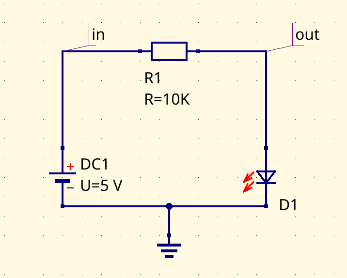
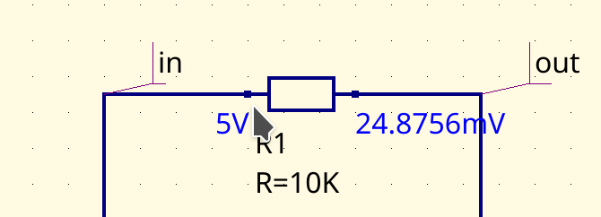

# XiaoXuan Circuit

XiaoXuan Circuit is a modern HDL (hardware description language) and simulation program for analog circuits with a graphical interactive interface.

XiaoXuan Circuit 是一个现代的、具有图形交互界面的模拟电子电路硬件描述语言及仿真程序。

- - -
| [中文](README.zh-hans.md) | [English](README.md) |
- - -

XiaoXuan Circuit 用于设计、分析模拟电子电路或者集成电路。程序利用现代计算机的强大运算能力，可以提高电路分析和设计效率。

## 特点

1. 使用易于阅读理解的语言来描述电路，无需手动绘制电路原理图；
2. 集成图形化的 _即时电路原理图渲染_ 功能；
3. 可导入导出 _S_ PICE 网表和仿真命令；
4. 集成交互式的图形仿真环境以及绘图功能；

## 示例

1. 简单的 LED 电路

以下一段是 XiaoXuan Circuit 电路描述代码：

```js
module reducer(in, out) {
    let R1 = new resistor() {value = 10k}
    conn(R1.1, in)
    conn(R1.2, out)
}

#[cfg(simulation)]
module sim1() {
    let DC1 = new dc_vol() {value = 5v}
    let D1 = new led() {color = LedColor::Red}
    let R1 = new reducer(DC1.p, D1.p)
    conn(DC1.n, D1.n, GND)
}
```

自动渲染的电路原理图如下：



仿真图形界面可可交互的，比如鼠标指针停留在各个节点或者连接线上，可以看到电压和电流值。



下面是一段仿真代码，该仿真的目的是线性地改变电阻器的值，然后观察 LED 的电流值。


2. 低通滤波电路与频域测试

TODO::

3. 变压整流电路与时域测试

TODO::

## 文档

1. [XiaoXuan Circuit 的安装及第一个程序](docs/quick-start.md)

2. [通过实例从零开始一步一步学习模拟电子](docs/tutorial/README.md)
   这个教程从最简单的欧姆定律开始讲解，到场效应晶体管到常用 IC，到数字的组合和时序电路。
   每一章都有 XiaoXuan Circuit 的程序源代码、仿真测试，同时在每一章后面附加相关的理论知识的讲解，以供有兴趣的读者参考。
   这个教程极其容易上手、没有晦涩难懂的文字，通过模拟环境高效率、生动有趣地掌握模拟电子知识。

3. [XiaoXuan Circuit 语法快速一览](docs/syntax-overview.md)
   XiaoXuan Circuit 语言包含了建模部分和仿真部分，通过这篇文章可以快速掌握该语言。

4. [XiaoXuan Circuit 语言参考](docs/reference/README.md)
